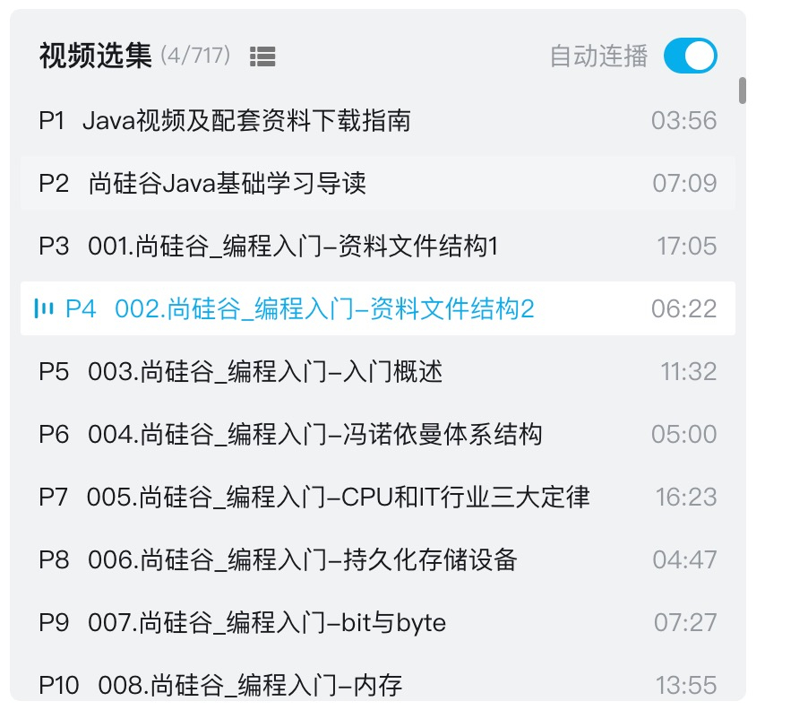
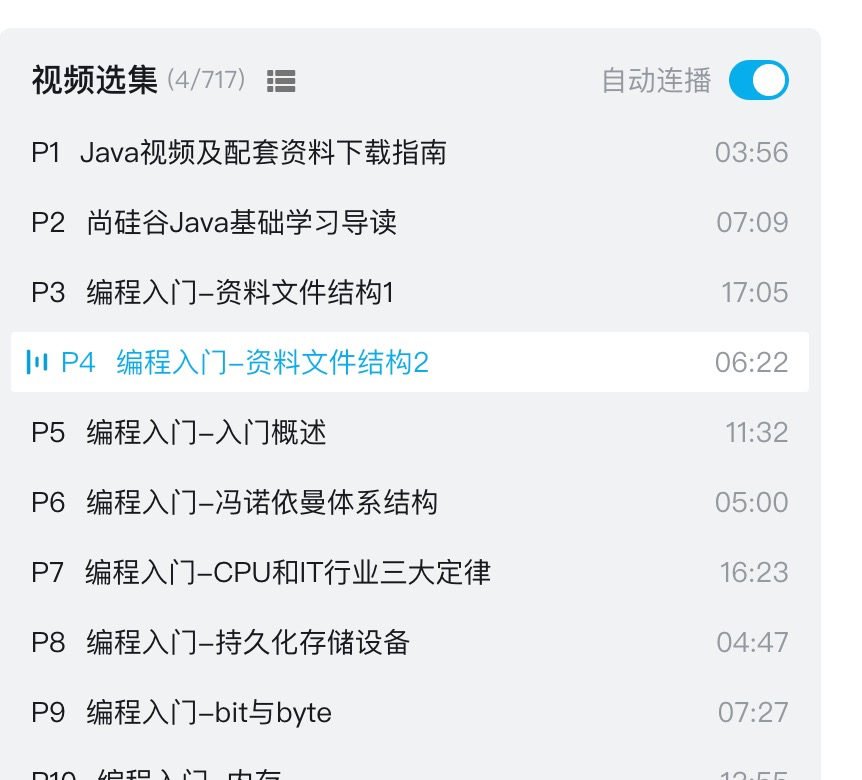

# tampermonkey-removePrefix-bilibili
 一个脚本去除bilibili视频分集的过长的前缀

## before



## after




#   修改使用网站
```javascript
  const configs = [
      {
          h1Title:'2022版Flink1.13实战教程', //h1标题
          reg:/\d{2,}_(第(.*)章_)?/					//前缀 正则 或 string
      },{
          h1Title:'尚硅谷Java入门视频教程',
          reg:/\d{2,}\.尚硅谷\_/
      }
  ]
```


